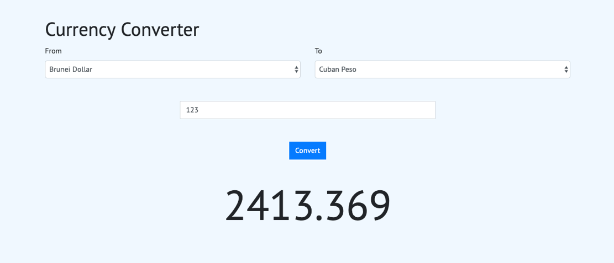

# currencyConverterWithVueJs

This is a simple app of a currency converter coded with VueJs and Axios.
I use the [currencyconverter](https://free.currencyconverterapi.com/) API to get a list of currency name
and the rate of exchange between each of them.

